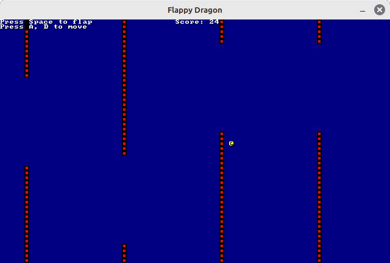
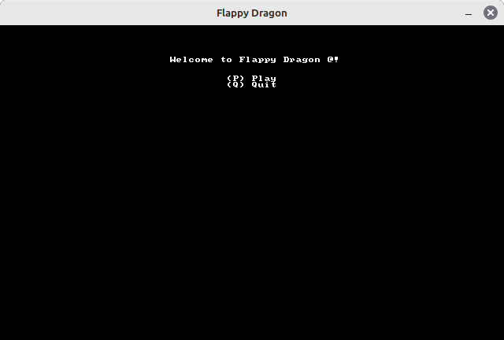

# Flappy Dragon

[English](docs/en/README.md) | 简体中文

[GNU General Public License Version 3](LICENSE.md)

Flappy Dragon 是一个 **Flappy Bird** 的简单 Rust 实现

这是一个非常简单的小游戏, 你只需要按下空格让小龙 `@`  往上飞, 使小龙不撞到障碍物即可得分

与好友比拼一下谁的得分多吧!

此实现参考的 [Bilibili 教程](https://www.bilibili.com/video/BV1vM411J74S)

教程相关的 [GitHub 仓库](https://github.com/HighValyrian/flappy_Game)

可联系我: [macrohard180@yeah.net](mailto:macrohard180@yeah.net)
