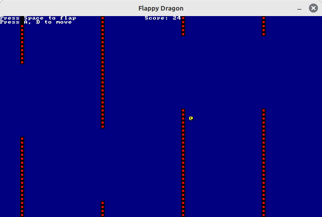
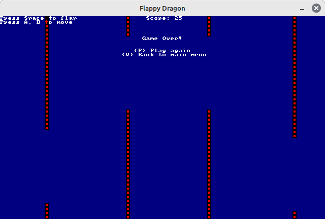
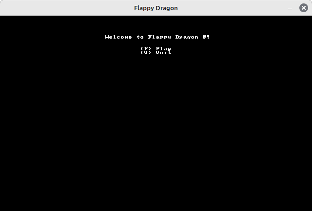
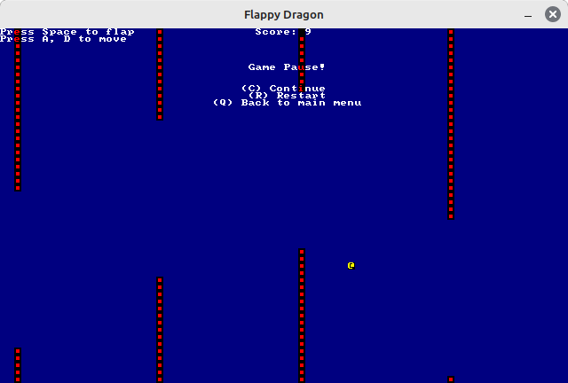

# Flappy Dragon

English | [简体中文](../zh/README.md)

[GNU General Public License Version 3](../../LICENSE.md)

Flappy Dragon is a simple Rust implementation of **Flappy Bird**

It's a very simple mini game. All you have to do is press space to send the dragon `@` flying upwards. Keep the dragon from hitting the obstacles to score points!

Compete with your friends to see who scores the most points!

This implementation is referenced in the [Bilibili tutorial](https://www.bilibili.com/video/BV1vM411J74S)

Tutorial-related [GitHub repo](https://github.com/HighValyrian/flappy_Game)

Contact details: [macrohard180@yeah.net](mailto:macrohard180@yeah.net)
